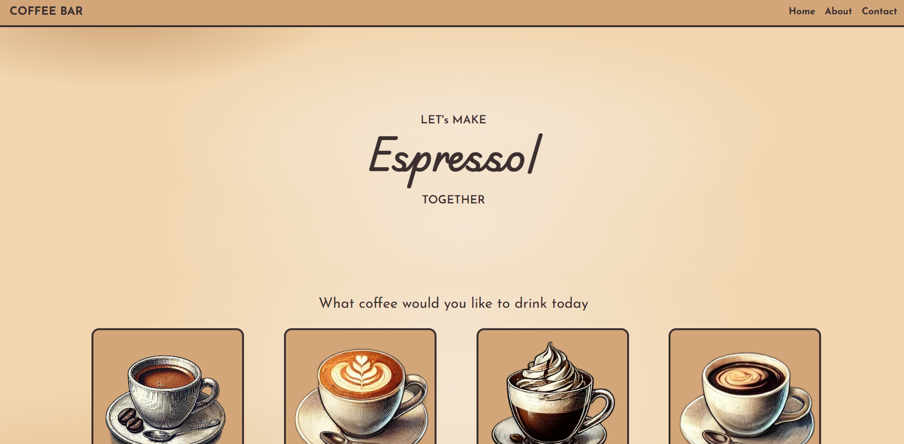

# **COFFEE BAR**

An aesthetic blog website for coffee lover. You can explore recipes for popular coffee.



## **RECIPES**

- Espresso
- Cappuccino
- Latte
- Americano
- Mocha
- Macchiato
- Flat White
- Irish Coffee

## **Teach Stack**

- **HTML, CSS, JAVASCRIPT**
- **Database**: data.json
- **Styling**: Tailwind Css
- **Version Control**: Git, GitHub

## **How to Run the Project**

1. **Clone the repository**:

   ```bash
   git clone https://github.com/HtetAungLw1n/coffee-bar.git
   ```

2. **Run this on terminal**:

   ```bash
   npm run dev
   ```

3. Open app/index.html with live server.
